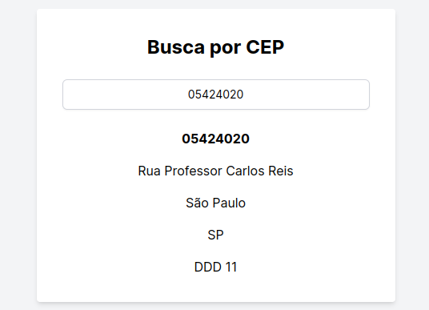
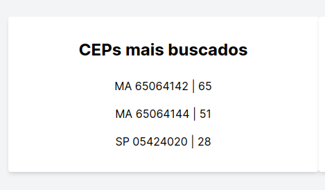
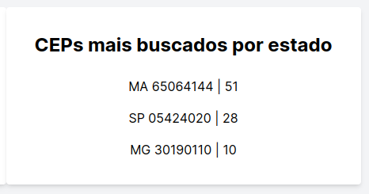
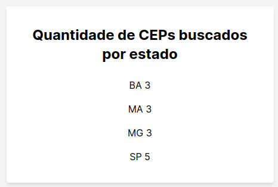

# buscaCep
Uma aplicação web para buscar endereços a partir de um CEP feita com Ruby on Rails, SQLite, HTML/CSS/JS

- [Instalação](#instalação)
- [Testes](#testes)
- [Funcionalidades](#funcionalidades)
  - [Buscar endereço](#buscar-endereço)
  - [CEPs mais buscados](#ceps-mais-buscados)
  - [CEPs mais buscados por estado/cidade](#ceps-mais-buscados-por-estado/cidade)
  - [Quantidade de CEPs buscados por estado](#quantidade-de-ceps-buscados-por-estado)
- [Banco de Dados](#banco-de-dados)
  - [Popular o banco de dados](#popular-o-banco-de-dados)
- [Motivação](#motivação)

## Instalação

### Requisitos
- Git
- Ruby
- Rails
- SQLite

### Clone o repositório e entre na pasta
```bash
git clone https://github.com/hreis1/buscaCep.git
cd buscaCep
```

### Instale as dependências
```bash
bundle install
```

### Rode o setup
```bash
rails bin/setup
```

### Rode o servidor
```bash
rails s
```
acesse a aplicação em [http://localhost:3000](http://localhost:3000)

## Testes
Execute o comando para rodar os testes:
```
rspec
```
Os testes são feitos com RSpec e cont´em testes unitários para os models e testes de sistema para a tela com o javascript.

## Funcionalidades

### Buscar endereço
Na página inicial, digite um CEP no campo de busca e após digitar o oitavo dígito, o endereço correspondente ao CEP será exibido. Caso o CEP não exista, uma mensagem de erro será exibida. Não é possível digitar letras ou caracteres especiais no campo de busca e o campo aceita apenas 8 dígitos. Assim que a página é carregada, o campo de busca é focado.



### CEPs mais buscados
Os CEPs mais buscados são exibidos numa caixa embaixo do campo de busca. Cada CEP tem a quantidade de vezes pesquisado. Caso não haja CEPs pesquisados, a caixa não é exibida.




### CEPs mais buscados por estado/cidade
Os CEPs mais buscados por estado/cidade são exibidos numa caixa embaixo do campo de busca. Cada CEP tem a quantidade de vezes pesquisado. Caso não haja CEPs pesquisados, a caixa não é exibida.



### Quantidade de CEPs buscados por estado

A quantidade de CEPs buscados por estado é exibida numa caixa embaixo dos campos anteriores. Cada estado tem a quantidade de CEPs pesquisados. Caso não haja CEPs pesquisados, a caixa não é exibida.



## Banco de Dados
O banco de dados utilizado é o SQLite. Ele é criado automaticamente quando o servidor é iniciado pela primeira vez, inicializado com as configurações do arquivo `./db/schema.rb`, criando as tabelas necessárias.

### Popular o banco de dados
Execute o comando para popular o banco de dados com alguns CEPs:
```bash
rails db:seed
```

# Motivação
A aplicação foi feita para ser simples e eficiente. A busca de endereços a partir de um CEP é feita de forma rápida e sem a necessidade de recarregar a página ou usar o mouse para selecionar o input. Além disso, a aplicação exibe informações úteis como os CEPs mais buscados e a quantidade de CEPs buscados por estado. Os testes foram feitos para garantir o funcionamento correto da aplicação inclusive com o javascript. A consulta de endereços é feita buscando o CEP primeiramente na base de dados local, evitando consultas desnecessárias à API externa, e caso o CEP não seja encontrado, a aplicação faz uma consulta à API externa através do modelo 'SearchCep' que encapsula a lógica de busca de CEPs.
